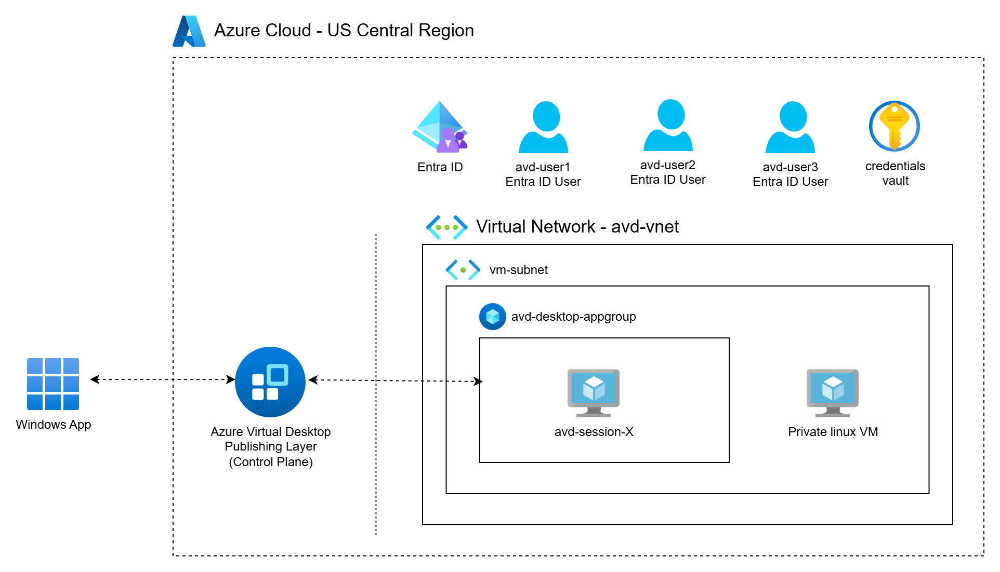
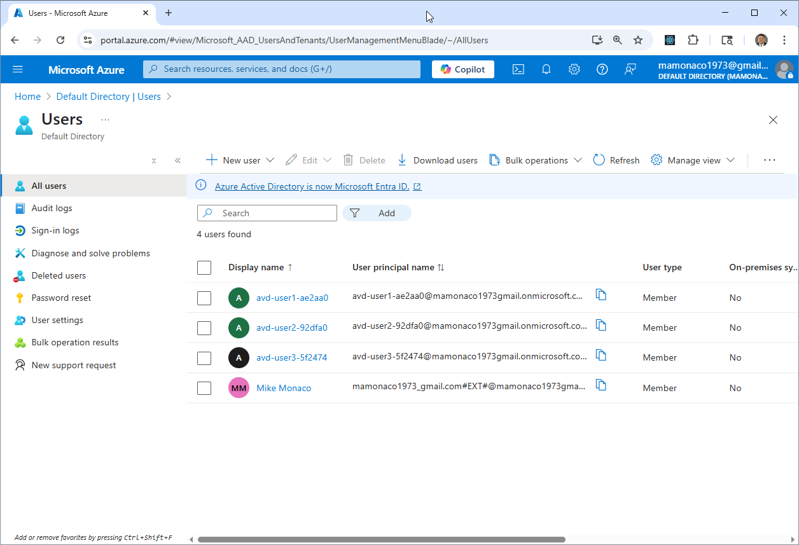
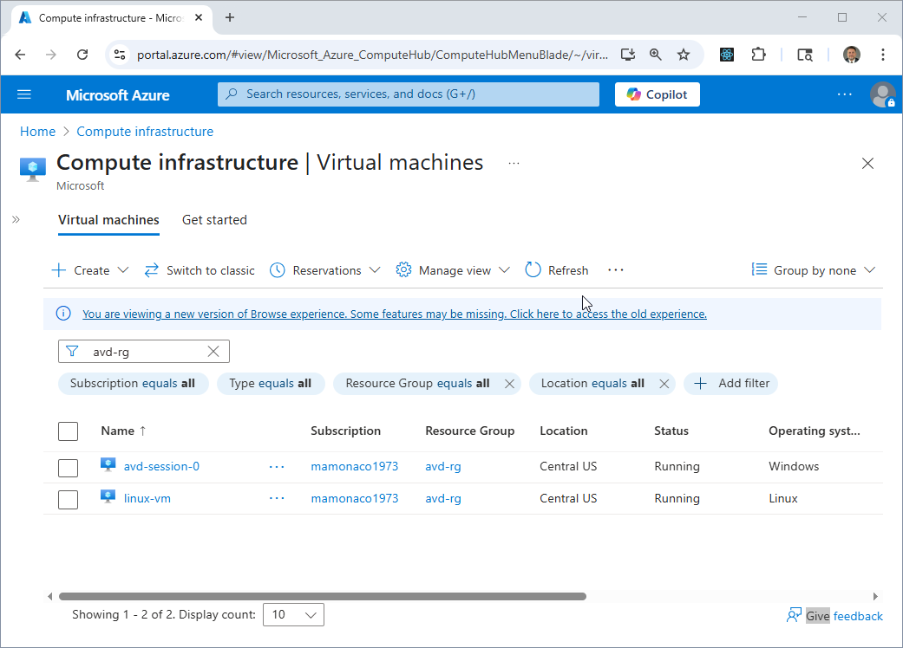
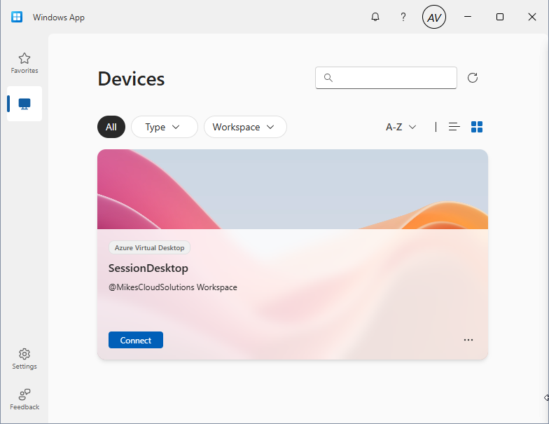
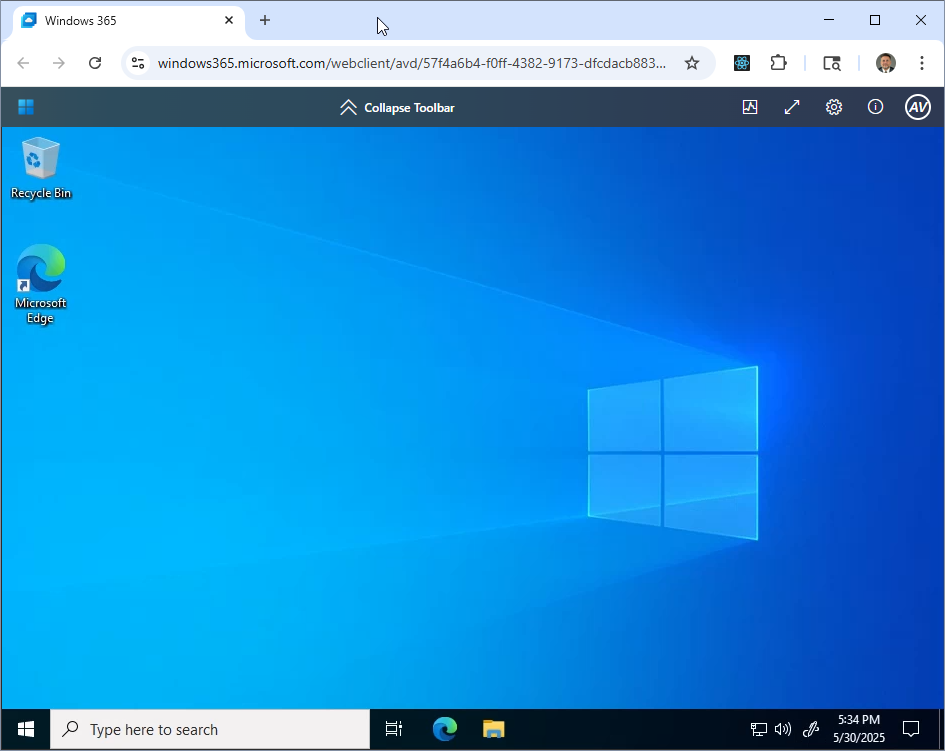

# Azure Virtual Desktop

In this video we will —

- Deploy a fully automated **Azure Virtual Desktop** environment using Terraform  
- Use **Windows Server 2022** session hosts joined directly to **Entra ID**  
- Create a pooled **host pool**, application group, and workspace  
- Bootstrap each session host with the AVD agent and Entra ID login support  
- Generate dynamic Entra ID users with randomized logins and secure credentials  
- Store credentials securely in **Azure Key Vault**

## Introduction

This project demonstrates how to deploy a modern, cloud-native **Azure Virtual Desktop** solution without domain controllers or hybrid join:

- A **pooled host pool** is created in `Central US`, using **Windows Server 2022**
- Session hosts are joined directly to **Entra ID** and auto-registered with the host pool
- Users like `avd-user1-xxxxxx` are generated dynamically and granted AVD and VM access
- A full **workspace** is published, allowing users to connect via the AVD client on the public internet
- Once inside the desktop environment, users can securely access private resources within the virtual network — effectively allowing AVD to function as a lightweight alternative to a traditional VPN.


## Overview of Desktop as a Service

**Desktop as a Service (DaaS)** delivers cloud-hosted virtual desktops to end users, eliminating the need for physical hardware or traditional on-premises VDI infrastructure. Organizations can provision secure, scalable desktop environments directly from the cloud with simplified deployment and centralized control.

Users can connect from anywhere using the Remote Desktop client or browser, while IT teams benefit from unified identity management, integrated security, and flexible cost control.

**Azure Virtual Desktop (AVD)** is Microsoft’s DaaS solution, providing Windows 10/11 and Windows Server-based desktops with seamless integration to Entra ID (formerly Azure AD), Microsoft 365, and other Azure services. It supports features like:

- Direct Entra ID join (no domain controllers required)  
- Auto-scaling and session-based load balancing  
- Pooled or personal desktops with granular access control  
- Integration with Azure Files, FSLogix, and Key Vault for storage and identity management

Common use cases include:

- Secure remote work for employees, contractors, and partners  
- Cloud desktops for training, development, or regulated workloads  
- Reducing IT overhead for desktop provisioning, patching, and compliance  
- Enabling scalable desktops in hybrid or fully cloud-native environments

## Prerequisites


## Prerequisites

* [An Azure Account](https://portal.azure.com/)
* [Install AZ CLI](https://learn.microsoft.com/en-us/cli/azure/install-azure-cli) 
* [Install Latest Terraform](https://developer.hashicorp.com/terraform/install)
* [Microsoft.AAD](https://learn.microsoft.com/en-us/azure/role-based-access-control/permissions/identity#microsoftaad) Provider must be enabled
* `Global Administrator` **Entra ID** role must be assigned to build identity
* [Windows App](https://apps.microsoft.com/detail/9n1f85v9t8bn?hl=en-US&gl=US) needs to be installed to access the azure virtual desktop.

If this is your first time watching our content, we recommend starting with this video: [Azure + Terraform: Easy Setup](https://www.youtube.com/watch?v=wwi3kVgYNOk). It provides a step-by-step guide to properly configure Terraform, Packer, and the AZ CLI.

## Download this Repository

```bash
git clone https://github.com/mamonaco1973/azure-virtual-desktops.git
cd azure-virtual-desktops
```

## Build the Code

Run [check_env](check_env.sh) then run [apply](apply.sh).

```bash
azure-virtual-desktops$ ./apply.sh
NOTE: Validating that required commands are found in your PATH.
NOTE: az is found in the current PATH.
NOTE: terraform is found in the current PATH.
NOTE: jq is found in the current PATH.
NOTE: All required commands are available.
NOTE: Validating that required environment variables are set.
NOTE: ARM_CLIENT_ID is set.
NOTE: ARM_CLIENT_SECRET is set.
NOTE: ARM_SUBSCRIPTION_ID is set.
NOTE: ARM_TENANT_ID is set.
NOTE: All required environment variables are set.
NOTE: Logging in to Azure using Service Principal...
NOTE: Successfully logged into Azure.
NOTE: Default domain for account is mamonaco1973gmail.onmicrosoft.com
Initializing the backend...
Initializing provider plugins...
- Reusing previous version of hashicorp/azurerm from the dependency lock file
- Reusing previous version of hashicorp/random from the dependency lock file
- Reusing previous version of hashicorp/azuread from the dependency lock file
- Using previously-installed hashicorp/azurerm v4.30.0
- Using previously-installed hashicorp/random v3.7.2
- Using previously-installed hashicorp/azuread v3.4.0

Terraform has been successfully initialized!
[...]
```
## Review Build Results

After deploying the Azure Virtual Desktop (AVD) environment, you’ll find several key components provisioned and visible in the Azure portal:

---

### **Entra ID Users**

Entra ID (formerly Azure AD) users are created to enable secure authentication into the virtual desktop environment. These users are assigned the necessary permissions to access and manage the AVD session hosts.



---

### **Virtual Machines**

Two virtual machines are deployed as part of the setup:

- **AVD Session Host**: A Windows Server VM configured for Azure Virtual Desktop. This host is domain-joined to Entra ID and serves as the remote desktop environment.
- **Linux Web Server**: A private Linux VM hosting an Apache HTTP server, reachable only from within the virtual network—ideal for testing private resource access from the session host.



---

### **Windows App Client**

The `Windows App` client is used to connect to the Azure Virtual Desktop environment. Entra ID users sign in through this application to launch their remote session securely.



---

### **Azure Virtual Desktop Environment**

The deployed AVD session host is joined to Entra ID and resides within a secure virtual network. From this virtual desktop, users can access internal resources like the Linux web server without requiring a public IP or VPN—enabling secure, remote productivity.



## Steps to Log Into Your AVD Instance

1. **Launch the Windows App Client**  
   Start the Windows App client on your local machine.

2. **Retrieve AVD User Credentials**  
   Use Azure Key Vault to retrieve the credentials for one of the Entra ID AVD users (e.g., `avd-user1-XXXXX`).

3. **Sign In**  
   Log in to the Windows App client using the retrieved credentials.

4. **Enable MFA (If Prompted)**  
   If prompted, complete Multi-Factor Authentication for the AVD user.

5. **Connect to Session Desktop**  
   Click on the **SessionDesktop** to initiate the remote connection.

6. **Wait for Desktop to Launch**  
   Wait for your Windows desktop environment to fully load.

7. **Locate Linux VM Private IP**  
   In the Azure Console, find the **private IP address** of the Linux VM.

8. **Access the Apache HTTP Page**  
   Open Microsoft Edge in the AVD session and navigate to `http://<private-ip>`.  
   You should see the default Apache HTTP welcome page.

## Run the "destroy" script when you are done

```bash
~/azure-virtual-desktops$ ./destroy.sh
NOTE: Default domain for account is mamonaco1973gmail.onmicrosoft.com
Initializing the backend...
Initializing provider plugins...
- Reusing previous version of hashicorp/azurerm from the dependency lock file
- Reusing previous version of hashicorp/random from the dependency lock file
- Reusing previous version of hashicorp/azuread from the dependency lock file
- Using previously-installed hashicorp/azurerm v4.30.0
- Using previously-installed hashicorp/random v3.7.2
- Using previously-installed hashicorp/azuread v3.4.0

Terraform has been successfully initialized!

You may now begin working with Terraform. Try running "terraform plan" to see
any changes that are required for your infrastructure. All Terraform commands
should now work.

If you ever set or change modules or backend configuration for Terraform,
rerun this command to reinitialize your working directory. If you forget, other
commands will detect it and remind you to do so if necessary.
random_password.avd_user_password["user3"]: Refreshing state... [id=none]
random_string.key_vault_suffix: Refreshing state... [id=ipegtil7]
[...]
```

